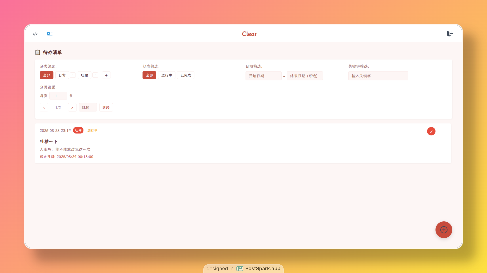

# Clear

<p align="center">
  
</p>

> **简洁之美，效率之选**

Clear是一款极简而强大的待办事项管理应用，专为注重效率和简洁的用户设计。通过精心打造的界面和强大的功能，帮助您轻松管理日常任务，提高工作效率。



[预览地址](https://clear.1wind.cn/)

## 为什么选择Clear?

- 🚀 **高效简洁** - 专注于核心功能，没有繁琐干扰
- 🎨 **美观定制** - 多种主题和自定义选项满足个性需求
- 🔒 **安全可靠** - 数据安全存储，支持账户系统
- 🔄 **跨平台同步** - 随时随地访问您的任务列表
- 💡 **智能提醒** - 不错过任何重要待办事项

## 核心功能

- ✨ **任务管理** - 流畅添加、快速编辑与一键删除，高效处理每日待办
- ✅ **智能完成** - 任务完成状态追踪，清晰展示工作进度与成就
- 🎨 **精致界面** - 遵循极简设计原则，减少视觉干扰，专注任务本身
- 🌈 **多彩主题** - 四大视觉主题（明亮、深邃、自然、极简），满足个性化需求
- 📊 **分类系统** - 强大的任务分类与标签体系，井然有序地组织工作生活
- 🔍 **智能检索** - 多维度搜索与筛选功能，快速定位任何任务信息
- 💾 **安全存储** - 后端采用高效持久化存储策略，数据安全不丢失
- ⚡ **极速体验** - 优化前端响应速度，带来轻量快速的用户操作体验
- 📱 **全端适配** - 自适应响应式设计，完美兼容桌面与移动设备

## 技术架构

### 核心技术栈
- **前端架构**：Vue 3 + Vite + TypeScript + Pinia
  *现代化组件框架 + 高效构建工具 + 类型安全 + 状态管理*
- **后端支撑**：Spring Boot 3 + Redis + MySQL 8
  *企业级应用框架 + 高性能缓存 + 可靠数据存储*

### 即将推出
- **个人版**: Go + SQLite (极简数据库，低内存占用)[支持个人部署]
- **邮件在线提醒**
- **用户的需求[只要我能做到]**

## 本地运行

```bash
# 克隆仓库
git clone https://github.com/WindyDante/Clear.git
cd Clear

# 前端设置
cd Clear-Web
pnpm install
pnpm run dev

# 后端设置（需要Java 17+和Maven）
cd ../Clear-Backend
mvn clean package
java -jar clear-server/target/clear-server-1.0.0.jar
```

## 致谢

项目基于[Tika](https://github.com/lin-snow/Tika)模板进行修改开发。在此特别感谢原作者[lin-snow](https://github.com/lin-snow)的开源贡献，提供了这个优秀的项目。

本项目在Tika的基础上进行了个性化定制和功能扩展，旨在满足特定需求。保留了原项目的精髓，同时融入了新的设计理念和功能特性。

- 感谢AI

- 感谢所有开源社区的贡献者与支持者  

## 支持项目

如果您喜欢这个项目，请考虑给我一个Star⭐，这将是对我最大的支持！后续会推出个人版的Go后端+SQLite极简数据库，将极度压缩内存占用，为个人用户提供更轻量级的解决方案。

